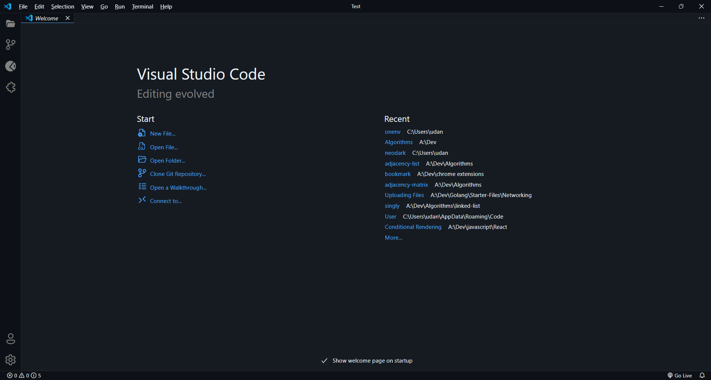
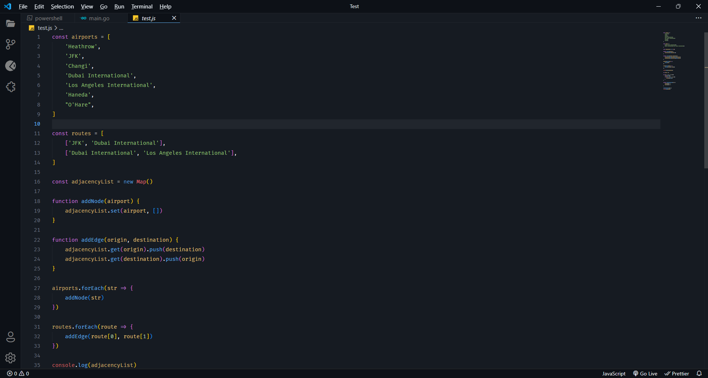
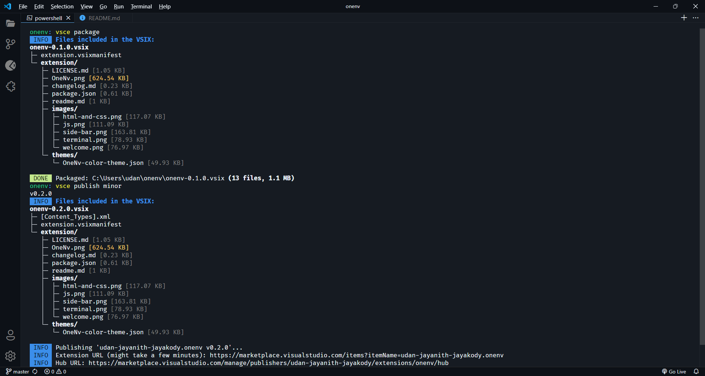
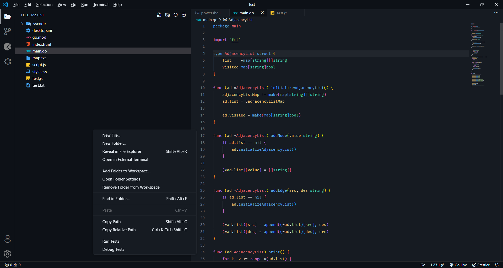
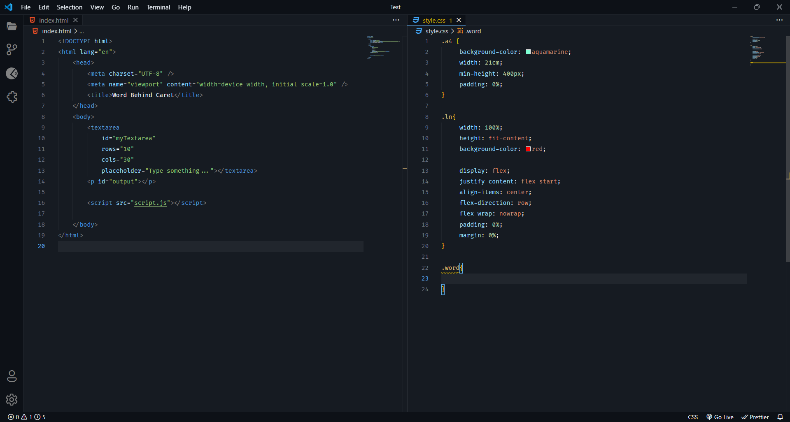

# OneNvTheme 🌌

**OneNvTheme** is a sleek, dark VS Code theme designed for developers who love a clean, minimalist interface. Its carefully chosen colors aim to reduce eye strain while enhancing code readability.

---

## Features ✨
- A modern, developer-friendly color palette.
- Optimized for readability and focus.
- Subtle highlights for syntax and UI elements.
- Works perfectly with light and dark environments.

---

## Preview 🖼️
### 1. Welcome page

### 1. Editor with JavaScript

### 2. Terminal Styling

### 3. Sidebar and File Explorer

### 4. HTML and CSS

---

## Feedback and Contributions 💡
Feel free to open issues or submit pull requests for improvements and bug fixes. Your contributions are welcome!

---

## License 📜
This theme is licensed under the [MIT License](./LICENSE.md).
